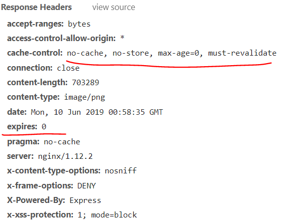

### TODO

- 刚开始显示时，图片会很大地闪烁一下
- 兼容非模块化引入 :dash:
- 父容器边界 :dash:
  需要放大的图片所在父容器
  可以显示图片的父容器

### TEST

- 当前页显示，进入其他页需要隐藏，回到当前页需要再显示

### 注意

如果图片设置了不缓存的话，那么在mousemove的过程中会一直重新请求img，就不能正常显示放大图了，只有在结束的那一刻才会显示。

### 参考

[img-vuer](https://github.com/ssshooter/img-vuer)
